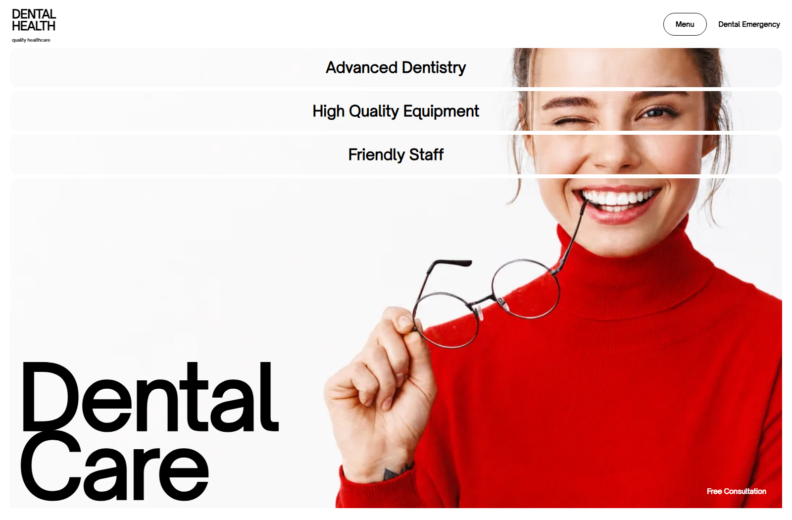
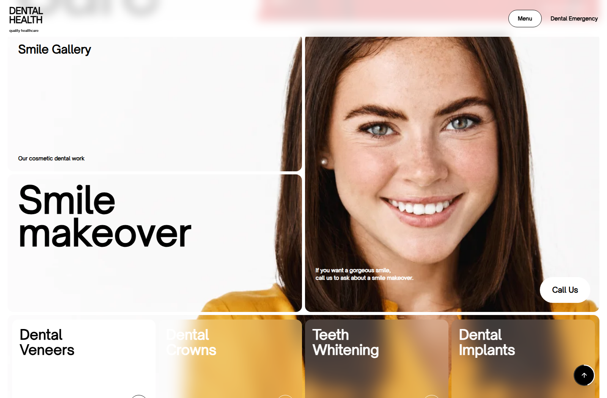
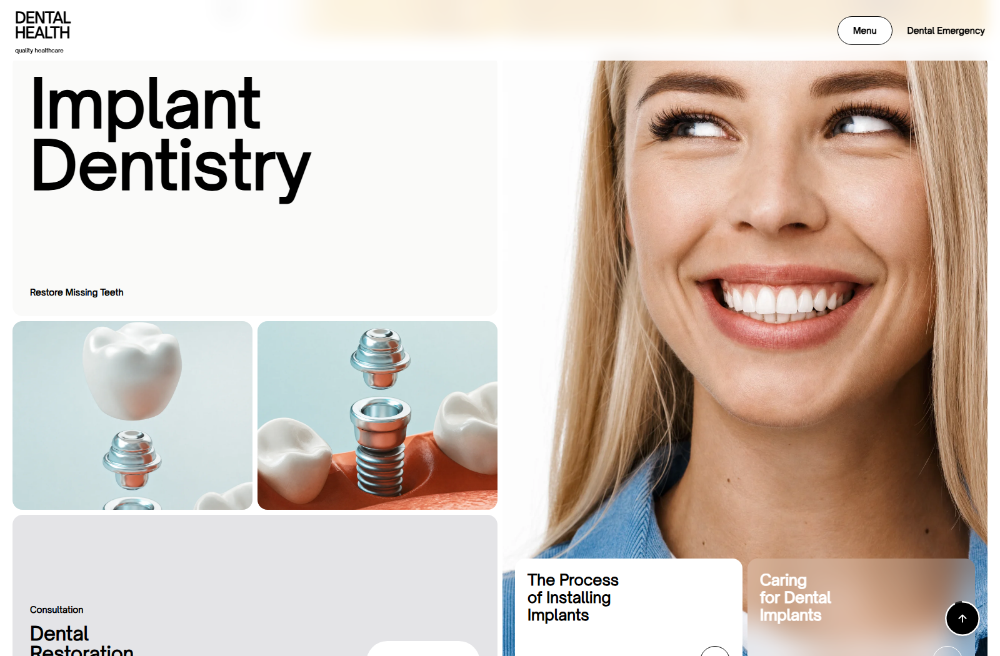

<div align="center">

# 🦷 Dental Health — Modern Dental Clinic Landing Page

A modern, single-page landing site for a dental clinic — built with **React 19**, **TypeScript**, **Vite** and **Tailwind CSS**. Fully responsive, animation-driven, and crafted around a custom "masked-card" image mosaic technique.

<br />

[](https://modern-dental-clinic-nik.netlify.app/)

<br />

[](https://react.dev/)
[](https://www.typescriptlang.org/)
[](https://vite.dev/)
[](https://tailwindcss.com/)
[](https://www.netlify.com/)

<br />

<a href="https://modern-dental-clinic-nik.netlify.app/">
  
</a>

</div>

---

## 🔗 Live Demo

**👉 [modern-dental-clinic-nik.netlify.app](https://modern-dental-clinic-nik.netlify.app/)**

One click and the site opens — no setup required.

---

## 📖 Table of Contents

- [Overview](#-overview)
- [Screenshots](#-screenshots)
- [Features](#-features)
- [Tech Stack](#-tech-stack)
- [Getting Started](#-getting-started)
- [Available Scripts](#-available-scripts)
- [Project Structure](#-project-structure)
- [Deployment](#-deployment)
- [Author](#-author)
- [License](#-license)

---

## 🎯 Overview

**Dental Health** is a polished, conversion-focused landing page for a modern dental practice. The whole UI lives in a single, well-structured `App.tsx` — no external UI or icon libraries — to keep the bundle tiny and the code fully under control.

The centrepiece is a **"masked-card" mosaic**: a single shared background image is sliced across multiple cards using calculated `background-position` offsets, so a grid of cards reads as one seamless photograph. Positions are recomputed responsively via a `ResizeObserver`, and sections reveal on scroll through an `IntersectionObserver`.

---

## 📸 Screenshots

| Hero | Smile Gallery | Implant Dentistry |
| :---: | :---: | :---: |
|  |  |  |

---

## ✨ Features

- 🎭 **Masked-card image mosaic** — one photo shared across cards via computed `background-position` offsets for a seamless layout.
- 📱 **Fully responsive** — mobile slide-out menu and a desktop full-screen **glass** menu (`backdrop-blur`) with staggered link reveals and a hover-swapped preview image.
- 🧭 **Smooth-scroll navigation** — nav links scroll to the matching section; the "Dental Health" logo scrolls back to the top.
- ⬆️ **Back-to-top button** — floating control with an SVG scroll-progress ring that fills as you read; auto-hides near the footer.
- 🎬 **Scroll-triggered reveals** — sections fade/slide in via `IntersectionObserver`.
- 🖱️ **Refined interaction details** — global `cursor: default` + `user-select: none` so the site reads like an app, not a text document (inputs stay selectable).
- ⚡ **Zero UI dependencies** — no component or icon library; everything is hand-built for a lean production bundle.
- 🔤 **Custom typography** — the "Open Sauce One" typeface.

---

## 🧰 Tech Stack

| Category | Technology |
| --- | --- |
| **Framework** | [React 19](https://react.dev/) |
| **Language** | [TypeScript](https://www.typescriptlang.org/) (strict mode) |
| **Build Tool** | [Vite 8](https://vite.dev/) |
| **Styling** | [Tailwind CSS 3.4](https://tailwindcss.com/) + PostCSS + Autoprefixer |
| **Linting** | [Oxlint](https://oxc.rs/) |
| **Hosting** | [Netlify](https://www.netlify.com/) |

---

## 🚀 Getting Started

### Prerequisites

- [Node.js](https://nodejs.org/) **18+** (developed on v24)
- npm (bundled with Node.js)

### Installation

```bash
# 1. Clone the repository
git clone https://github.com/Niko5886/Modern-Dental-Landing-Page.git

# 2. Move into the project directory
cd Modern-Dental-Landing-Page

# 3. Install dependencies
npm install

# 4. Start the development server
npm run dev
```

The app will be available at **http://localhost:5173** (Vite picks the next free port if it's taken).

---

## 📜 Available Scripts

| Command | Description |
| --- | --- |
| `npm run dev` | Start the Vite dev server with hot-module replacement. |
| `npm run build` | Type-check (`tsc -b`) and build the production bundle into `dist/`. |
| `npm run preview` | Serve the production build locally to preview it. |
| `npm run lint` | Run Oxlint over the codebase. |

---

## 📂 Project Structure

```
Modern-Dental-Landing-Page/
├── docs/
│   └── screenshots/        # README preview images
├── public/                 # Static assets (favicon, icons)
├── src/
│   ├── App.tsx             # Entire UI: sections, navbar, hooks, footer
│   ├── index.css           # Tailwind directives + global base styles
│   ├── App.css             # Component-scoped styles
│   └── main.tsx            # React entry point
├── index.html              # HTML shell + font links
├── tailwind.config.js
├── vite.config.ts
└── tsconfig*.json          # Strict TypeScript configuration
```

---

## 🌐 Deployment

The site is continuously deployed to **[Netlify](https://www.netlify.com/)**.

To ship a production build:

```bash
npm run build                          # outputs to dist/
netlify deploy --prod --dir=dist       # deploy the built site
```

---

## 👤 Author

**Nikolay Stoyanov** — AI-Native Full-Stack Developer

- 🌐 Portfolio: [nikolay-ai-native-developer.netlify.app](https://nikolay-ai-native-developer.netlify.app/)
- 💻 GitHub: [@Niko5886](https://github.com/Niko5886)

---

## 📄 License

This project is released under the [MIT License](LICENSE). Feel free to use it as a reference or a starting point.

---

<div align="center">

⭐ If you like this project, consider giving it a star!

</div>
